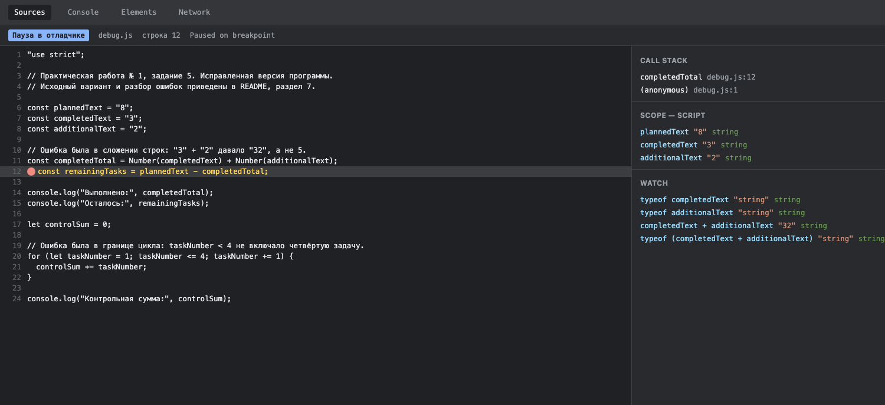

# Отчёт по практической работе № 1

**Тема:** Основы JavaScript. Один файл — две среды выполнения

## 1. Автор и вариант

**Имя:** Попов Илья Сергеевич  
**Группа:** ЭФБО-06-25  
**Номер в журнале:** N = 20  
**Вариант:** `((20 - 1) % 8) + 1 = 4`  
**Данные варианта:** `totalTasks = 20`, `completedTasks = 11`, `dailyLimit = 6`

## 2. Окружение

| Компонент | Версия |
|---|---|
| Операционная система | macOS 26.2 (arm64) |
| Node.js | v20.20.1 (проверено также на v24.21.0) |
| npm | 10.8.2 |
| Git | 2.50.1 (Apple Git-155) |
| Браузер | Google Chrome 154.0.8037.98 |

## 3. Запуск

Команды выполняются **из корня репозитория**:

```bash
node practice-01/js/hello.js
node practice-01/js/types.js
node practice-01/js/progress.js
node practice-01/js/plan.js
node practice-01/js/debug.js
```

В браузере: открыть `practice-01/index.html`, заменить путь в теге `script` на нужный файл,
сохранить, перезагрузить страницу и смотреть вывод в Console. В каждый момент подключается
только один файл: в них повторяются имена переменных верхнего уровня. Для задания 5 есть
отдельная страница `debug-run.html`, которая подключает `js/debug.js`.

## 4. Задание 1. Один файл — две среды выполнения

`js/hello.js` — один и тот же файл, запущенный двумя способами.

**В Node.js** (`node practice-01/js/hello.js`):

```text
Студент: Попов Илья Сергеевич
Группа: ЭФБО-06-25
Практическая работа: 1
JavaScript успешно запущен
Тип document: undefined
```

**В браузере** (страница через локальный сервер, вывод в Console):

```text
Студент: Попов Илья Сергеевич
Группа: ЭФБО-06-25
Практическая работа: 1
JavaScript успешно запущен
Тип document: object
```

Первые четыре строки совпадают: язык и сам файл одни и те же. Различается последняя строка.
В Node.js глобального объекта `document` нет — там нет DOM, поэтому `typeof document` даёт
`undefined`. В браузере `document` — объект документа, поэтому тип `object`. При этом вывод
появляется в разных местах: в Node.js — в терминале, в браузере — только в Console
(на самой странице ничего не печатается).

## 5. Задание 2. Типы и преобразования

Прогноз записан до запуска, затем проверен через `console.log`. Значение выражения и тип
самого результата для строк 9 и 10 разделены: `typeof null` возвращает строку `"object"`,
и тип этой строки — `string`.

| Выражение | Ожидание до запуска | Фактическое значение | Тип результата | Объяснение |
|---|---|---|---|---|
| `"8" + 2` | `"82"` | `82` | `string` | Оператор `+` со строкой выполняет конкатенацию: число приводится к строке, а не строка к числу |
| `"8" - 2` | `6` | `6` | `number` | Операции вычитания для строк нет, поэтому строка преобразуется в число |
| `Number("8") + 2` | `10` | `10` | `number` | Явное преобразование выполняется до сложения, дальше складываются два числа |
| `"12" > "3"` | `false` | `false` | `boolean` | Две строки сравниваются посимвольно по кодам: `"1"` (49) меньше `"3"` (51), поэтому результат ложный |
| `12 === "12"` | `false` | `false` | `boolean` | Строгое сравнение учитывает тип и не выполняет приведение |
| `Number("")` | `0` | `0` | `number` | Пустая строка преобразуется в ноль, а не в `NaN` |
| `Number("text")` | `NaN` | `NaN` | `number` | Нечисловая строка даёт `NaN`; тип результата всё равно `number` |
| `Boolean("false")` | `true` | `true` | `boolean` | Непустая строка всегда истинна, содержимое `"false"` не разбирается как логическое значение |
| `typeof null` | `"object"` | `object` | `string` | Историческая особенность языка: `typeof null` равно `"object"`; тип самого результата выражения — строка |
| `typeof NaN` | `"number"` | `number` | `string` | `NaN` имеет тип `number`; тип результата `typeof` — строка |

Особенно внимательно разобраны три случая: объединение строки с числом (`"8" + 2` даёт
строку `"82"`, поэтому дальше `+` уже опасен), преобразование пустой строки (ноль, а не
ошибка) и логическое преобразование непустой строки (`"false"` истинно, потому что строка
непустая). Прогнозы совпали с результатами во всех десяти выражениях.

## 6. Задание 3. Сводка выполнения задач

Алгоритм в `js/progress.js` проверяет, что оба значения — целые числа (`typeof value ===
"number"` и `Number.isInteger`), строки не преобразуются; проверяет границы
`0 ≤ totalTasks ≤ 1000` и `0 ≤ completedTasks ≤ totalTasks`; при недопустимых данных печатает
одну строку, начинающуюся с `Ошибка:`, без обычной сводки; при двух нулях печатает
`Задач пока нет` и не считает процент (деления на ноль нет); иначе выводит остаток, процент
`completedTasks / totalTasks * 100` через `toFixed(1)` и статус, определённый **по исходным
количествам**, а не по округлённому проценту.

| Проверка | Входные данные | Ожидаемый результат | Фактический результат | Итог |
|---|---|---|---|---|
| Обычный случай | `12`, `5` | Осталось 7; прогресс `41.7%`; статус «В работе» | Осталось 7; прогресс `41.7%`; статус «В работе» | Пройдено |
| Данные варианта | `20`, `11` | Осталось 9; прогресс `55.0%`; статус «В работе» | Осталось 9; прогресс `55.0%`; статус «В работе» | Пройдено |
| Оба нуля | `0`, `0` | «Задач пока нет», без расчёта процента | «Задач пока нет» | Пройдено |
| Ничего не выполнено | `5`, `0` | Осталось 5; прогресс `0.0%`; статус «Не начато» | Осталось 5; прогресс `0.0%`; статус «Не начато» | Пройдено |
| Выполнено всё | `5`, `5` | Осталось 0; прогресс `100.0%`; статус «Завершено» | Осталось 0; прогресс `100.0%`; статус «Завершено» | Пройдено |
| Верхняя граница | `1000`, `1000` | Допустимо: осталось 0; `100.0%`; «Завершено» | Допустимо: осталось 0; `100.0%`; «Завершено» | Пройдено |
| Дробный процент | `3`, `1` | Прогресс `33.3%`, статус «В работе» | Прогресс `33.3%`, статус «В работе» | Пройдено |
| Выполнено больше, чем есть | `5`, `6` | Ошибка, сводки нет | `Ошибка: выполнено больше задач, чем существует.` | Пройдено |
| Отрицательное общее | `-1`, `0` | Ошибка: выход за границу `0…1000` | `Ошибка: общее количество задач должно быть от 0 до 1000.` | Пройдено |
| Отрицательное выполнено | `20`, `-1` | Ошибка: отрицательное количество выполненных | `Ошибка: количество выполненных задач не может быть отрицательным.` | Пройдено |
| Дробное значение | `5`, `2.5` | Ошибка: количество не целое | `Ошибка: количество задач должно быть целым числом.` | Пройдено |
| Строка вместо числа | `"5"`, `2` | Ошибка: строки не преобразуются | `Ошибка: количество задач должно быть целым числом.` | Пройдено |
| Превышена верхняя граница | `1001`, `0` | Ошибка: больше 1000 | `Ошибка: общее количество задач должно быть от 0 до 1000.` | Пройдено |
| `NaN` | `NaN`, `0` | Ошибка: недопустимое числовое значение | `Ошибка: количество задач должно быть целым числом.` | Пройдено |

Проверки выполнялись запуском файла с изменёнными исходными значениями; после проверок в
файле возвращены данные варианта (`20`, `11`). Дополнительно в `js/progress-runs.js` собраны
повторные запуски: файл меняет только входные данные, расчёт остаётся в `progress.js` и не
дублируется.

## 7. Задание 4. План выполнения задач по дням

`js/plan.js` использует те же проверки, что и задание 3, плюс обязательную проверку дневной
нормы (`dailyLimit` — целое от 1 до 1000) **даже при отсутствии оставшихся задач**.
Планируются только оставшиеся задачи; каждый день выполняется не больше `dailyLimit`,
а за последний день — не больше, чем осталось (`Math.min`). Цикл `while` уменьшает остаток и
не может уйти в минус, потому что выполняется только пока `remaining > 0`. Если все задачи
выполнены, цикл не запускается и выводится `Потребуется дней: 0`.

**Вывод для варианта 4** (`20`, `11`, `6`):

```text
Осталось задач: 9
День 1: выполнено 6, осталось 3
День 2: выполнено 3, осталось 0
Потребуется дней: 2
```

| Проверка | `totalTasks` | `completedTasks` | `dailyLimit` | Ожидаемый результат | Фактический результат | Итог |
|---|---|---:|---:|---|---|---|
| Обычный случай | 12 | 5 | 3 | 3 дня; в последний день 1 задача | День 1: 3, День 2: 3, День 3: 1; дней 3 | Пройдено |
| Ровное деление | 10 | 4 | 3 | 2 дня, по 3 задачи | День 1: 3, День 2: 3; дней 2 | Пройдено |
| Норма больше остатка | 5 | 3 | 10 | 1 день, только 2 задачи | День 1: 2; дней 1 | Пройдено |
| Данные варианта | 20 | 11 | 6 | 2 дня (6 и 3) | День 1: 6, День 2: 3; дней 2 | Пройдено |
| Всё выполнено | 5 | 5 | 2 | 0 дней, цикл не выполняется | «Все задачи уже выполнены», дней 0 | Пройдено |
| Оба нуля | 0 | 0 | 2 | 0 дней | Дней 0 | Пройдено |
| Верхняя граница | 1000 | 0 | 1000 | 1 день, все 1000 задач | День 1: 1000; дней 1 | Пройдено |
| Норма равна нулю | 5 | 2 | 0 | Ошибка, цикл не запускается | `Ошибка: дневная норма должна быть целым числом от 1 до 1000.` | Пройдено |
| Дробная норма | 5 | 2 | 1.5 | Ошибка | `Ошибка: все количества должны быть целыми числами.` | Пройдено |
| Выполнено больше общего | 5 | 6 | 2 | Ошибка | `Ошибка: количество выполненных задач не может быть отрицательным или больше общего.` | Пройдено |
| Норма строкой | 5 | 2 | `"2"` | Ошибка: строка не преобразуется | `Ошибка: все количества должны быть целыми числами.` | Пройдено |
| Норма больше 1000 | 5 | 2 | 1001 | Ошибка: превышена верхняя граница | `Ошибка: дневная норма должна быть целым числом от 1 до 1000.` | Пройдено |

Ни в одном допустимом случае остаток не стал отрицательным, а при недопустимых данных цикл
не запускался и бесконечного выполнения не возникало.

## 8. Задание 5. Поиск логических ошибок через DevTools

**Исходный вариант и его фактический вывод** (до исправления):

```text
Выполнено: 32
Осталось: -24
Контрольная сумма: 6
```

Ошибки нашлись две, и обе не приводили к исключению — программа «работала» с неверным
результатом:

| Ошибка | Что наблюдалось | Причина | Исправление | Результат после исправления |
|---|---|---|---|---|
| Обработка количества задач | `completedText + additionalText` дало `"32"` вместо `5`, затем `"8" - "32"` дало `-24` | `completedText` и `additionalText` объявлены строками, а `+` для строк выполняет конкатенацию | `Number(completedText) + Number(additionalText)` | `Выполнено: 5`, `Осталось: 3` |
| Граница цикла | `controlSum` равен 6 вместо 10: в сумму не вошла четвёртая задача | Условие `taskNumber < 4` останавливает цикл на 3, а нужна сумма номеров от 1 до 4 включительно | `taskNumber <= 4` | `Контрольная сумма: 10` |

**Вывод исправленной версии** (`js/debug.js`):

```text
Выполнено: 5
Осталось: 3
Контрольная сумма: 10
```

**Иллюстрация остановки.** Точка останова поставлена на строке вычисления `completedTotal`.
В момент остановки выполнена только часть строк, поэтому `completedTotal` ещё не определён,
а в области видимости видны исходные строки и результаты проверок через Watch:



Наблюдения в точке останова:

- `completedText` → `"3"`, тип `string`; `additionalText` → `"2"`, тип `string`;
- `typeof (completedText + additionalText)` → `"string"`, значение `"32"` — видно, что до
  исправления получалась строка, а не число;
- `remainingTasks` на следующем шаге (`Step over`) становится `-24`, потому что строка `"32"`
  вычитается из `"8"`.

После исправления точек останова в файле не осталось: запуск в браузере и в Node.js даёт
одинаковый результат `5 / 3 / 10`.

## 9. Вывод

Разобраны проверка типов без приведения, границы допустимых значений, разделение расчёта и
отображения (`toFixed` применяется только при выводе) и пошаговый план в цикле `while`.
Отдельно отработана работа с отладчиком: точка останова, область видимости, `Step over` и
контроль значений через Watch.

Наиболее показательной оказалась ошибка со сложением строк: исключения не возникало,
программа завершалась «успешно», но считала неверно (`"32"` вместо `5` и `-24` вместо `3`).
Второй поучительный случай — `(0, 0)`: процент не вычисляется, поэтому деление на ноль не
возникает, а вместо числовой сводки печатается одна понятная строка.
